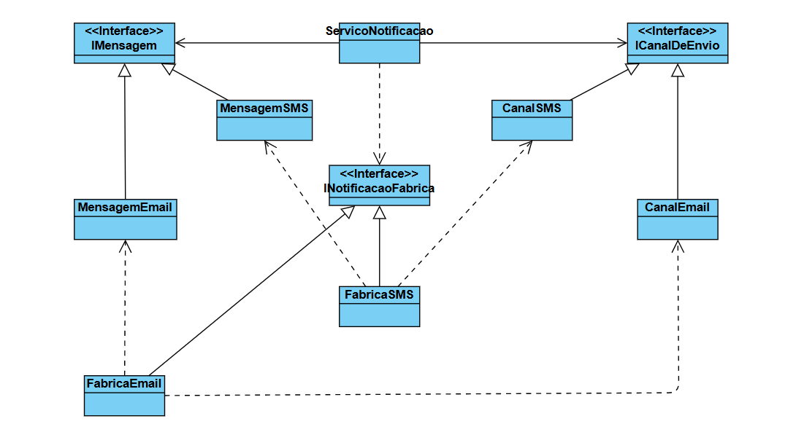

# Sistema de Notificações com Padrão Abstract Factory

Este projeto é uma implementação em Java de um sistema de notificações que demonstra o uso do padrão de projeto Abstract Factory. O objetivo é criar uma arquitetura de software flexível, permitindo que novos tipos de notificação (como E-mail, SMS, etc.) sejam adicionados com o mínimo de alteração no código.

## Estruturas

O padrão Abstract Factory fornece uma interface para criar famílias de objetos relacionados sem especificar suas classes concretas.

- **NotificacaoFabrica:** Interface que define os métodos para criar os produtos (IMensagem e ICanalDeEnvio).

- **FabricaEmail e FabricaSMS:** Implementações concretas que sabem como criar produtos para um contexto específico (e-mail ou SMS).

- **IMensagem e ICanalDeEnvio:** Interfaces que definem o contrato dos produtos que as fábricas podem criar.

- **MensagemEmail, CanalSMS, etc.:** As implementações reais dos produtos.

## Diagrama de Classes

